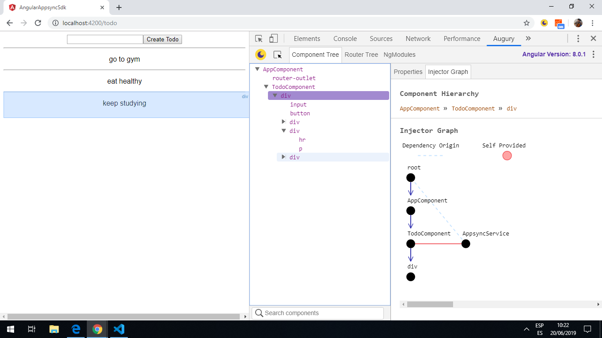
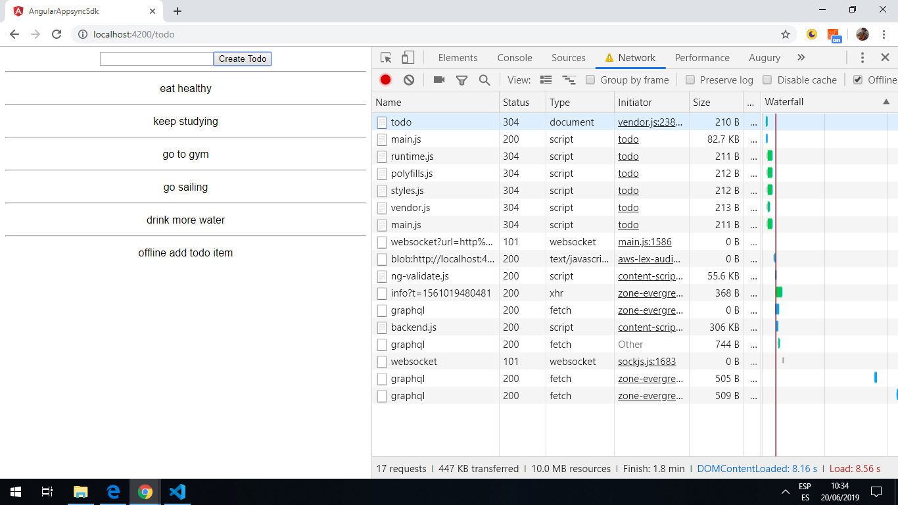

# :zap: Angular GraphQL AppSync

* App using Angular to create a todo list. AWS amplify and Appsync are used to communicate with a todo database, hosted in a GraphQL serverless AWS backend.
* The home screen displays an AWS authorization page. Once authorised the user can create todos that are listed in the UI.
* Amplify Appsync SDK is used to create mutations etc. Offline support is added so any todo items added while off line are shown on the UI then are added to the backend as part of the ngOnit lifecycle method.
* Upgrade to Angular 10 etc. does not work - consider replaceing with another AWS amplify and Appsync app

*** Note: to open web links in a new window use: _ctrl+click on link_**

## :page_facing_up: Table of contents

* [General info](#general-info)
* [Screenshots](#screenshots)
* [Technologies](#technologies)
* [Setup](#setup)
* [Features](#features)
* [Status](#status)
* [Inspiration](#inspiration)
* [Contact](#contact)

## :books: General info

* [AWS Amplify](https://aws.amazon.com/amplify/?nc1=h_ls) makes it easy to create, configure, and implement scalable mobile and web apps powered by AWS. It provides a framework to integrate the backend with iOS, Android, Web, and React Native frontends. It allows you to select the capabilities needed, e.g. authorization, analytics or offline data sync.

* [AWS Appsync SDK](https://aws-amplify.github.io/docs/js/start) enables integration of the app with the AWS AppSync service. The SDK supports multiple authorization models, handles subscription handshake protocols for real-time updates to data, and has built-in capabilities for offline support that makes it easy to integrate.

## :camera: Screenshots

.


## :signal_strength: Technologies

* [Angular v8.0.0](https://angular.io/)
* [Angular CLI v8.0.1](https://cli.angular.io/).
* [aws-amplify v1.1.29](https://www.npmjs.com/package/aws-amplify) core Javascript library. [Documentation](https://aws-amplify.github.io/docs/js/start?platform=purejs)
* [aws-amplify-angular v3.0.4](https://www.npmjs.com/package/aws-amplify-angular) AWS Amplify library package, with building blocks for Angular App development.

## :floppy_disk: Setup

* Run `ng serve` for a dev server. Navigate to `http://localhost:4200/`. The app automatically reloads if you change any of the source files.

## :computer: Code Examples

* `todo.component.ts` extract from ngOnInit showing how any todos added while offline are added to the backend database as part of the ngOnInit lifecycle method.

```Typescript
  ngOnInit() {
    this.appsync.funchc().then(client => {
      const observable = client.watchQuery({
        query: gql(listTodos),
        fetchPolicy: 'cache-and-network'
      });

      observable.subscribe(({data}) => {
        this.allTodos = data.listTodos.items;
      });
    });
  }
```

## Features

* The AWS Amplify push process creates a ./src/graphql folder structure and generates a new api in the AWS Appsync Console.

## Status & To-Do List

* Status: Working: Very basic aws todo database that stores data in a cache if offline.

* To-Do: Explore AWS Amplify further.

## Inspiration

* [AWS AppSync Tutorial - GraphQL APIs with AppSync, Amplify and Angular](https://www.youtube.com/watch?v=QEMfnr5MO1w)

## Contact

Repo created by [ABateman](https://www.andrewbateman.org) - feel free to contact me!
